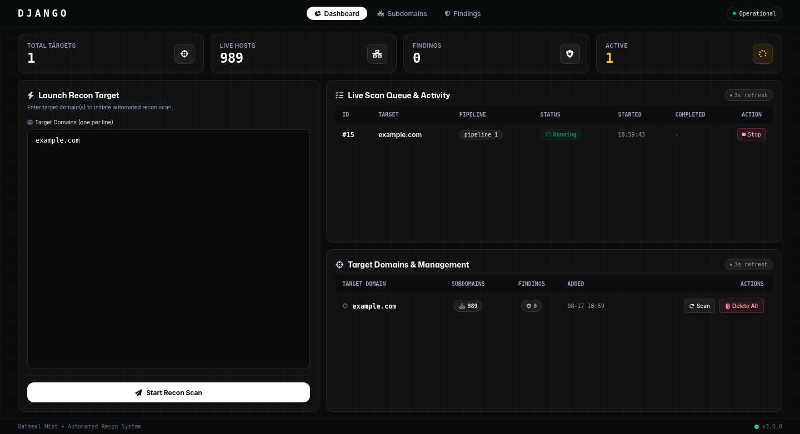
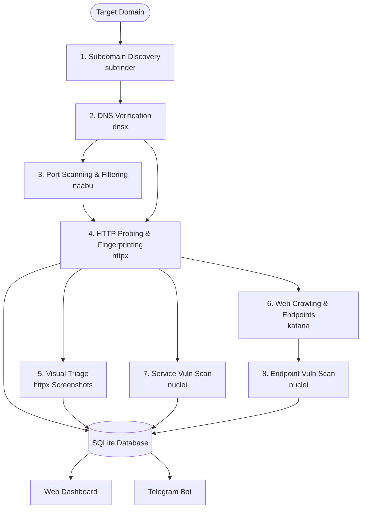

# DJANGO RECON — Automated Attack Surface Management & Bug Bounty Fleet Engine

<p align="center">
  
  
  
  
</p>

<p align="center">
  <b>A production-ready, highly optimized, multi-threaded Attack Surface Management (ASM) and automated reconnaissance platform built with Go, SQLite, and the ProjectDiscovery toolkit.</b>
  <br />
  <i>Engineered for bug bounty hunters, red teams, and security teams managing dozens to hundreds of root domains simultaneously.</i>
</p>

---

## Dashboard Preview

<!-- SCREENSHOT PLACEHOLDER: Place your dashboard screenshot at assets/dashboard.png -->
<p align="center">
  
</p>

---

## Key Features

- **Ultra-Fast Go Recon Engine**: Native Go backend orchestrating external CLI tools asynchronously with context timeouts, worker pools, and zero runtime bloat.
- **End-to-End Chained Pipeline**: Multi-stage data passing where each step intelligently pipes deduplicated results into downstream tools (`subfinder` ➔ `dnsx` ➔ `naabu` ➔ `httpx` ➔ `katana` ➔ `nuclei`).
- **High-Signal Vulnerability Detection**: Tailored template tagging focused on actionable security issues (CVEs, misconfigurations, takeovers, sensitive disclosures, XSS, SQLi, SSRF) without noisy false positives.
- **Interactive Web Dashboard**:
  - **Fleet Overview**: Real-time scan queue, progress tracking, target domain stats, and findings metrics.
  - **Subdomain Asset Explorer**: Filterable and sortable assets table with IP resolution, HTTP status codes, web server, technology badges, and live screenshot previews.
  - **Grouped Vulnerability Findings**: Unique template-based aggregation grouping recurring vulnerabilities across hundreds of targets into clean, inspectable view modals.
  - **Visual Triage Gallery**: Responsive grid view of all captured web page screenshots for rapid identification of login panels, admin dashboards, and exposed services.
- **Telegram Event-Driven Alerts**: Real-time instant notifications for scan progress, new asset discoveries (`+X new subs`), and high/critical vulnerability detections.
- **Single Binary & Zero Complexity**: Packaged as a standalone Go binary with embedded SQLite WAL mode database—no heavy Redis or PostgreSQL dependencies required.

---

## Recon Architecture & Pipeline



### Pipeline Steps Overview

| Step | Tool | Output / Action | Key Flags & Strategy |
| :--- | :--- | :--- | :--- |
| **1. Subdomain Enum** | `subfinder` | Passive subdomains | Multi-source aggregation, rate limits (`-all`, `-rl 75`) |
| **2. DNS Verification** | `dnsx` | Validated A/AAAA/CNAME records | High-speed multi-resolvers (`1.1.1.1, 8.8.8.8, 9.9.9.9`), `-omit-raw` |
| **3. Port Scan** | `naabu` | Open web/service ports | Smart web port range, CDN filter (`-ec`, `-verify`, `-cdn`, `-sr`) |
| **4. HTTP Probing** | `httpx` | Live URLs & rich metadata | Tech detect, JARM, HSTS, favicon hash, TLS grab, private IP exclusion |
| **5. Visual Triage** | `httpx` | Web screenshots | Chrome headless, custom viewport, stored in static gallery |
| **6. Crawling** | `katana` | Discovered URLs & forms | Breadth-first crawl (`-s breadth-first`), JS endpoint extraction (`-jc`) |
| **7. Vuln Scan** | `nuclei` | Service vulnerabilities | High-signal templates (`cve, exposure, misconfig, takeover, auth-bypass`) |
| **8. Endpoint Scan** | `nuclei` | Endpoint vulnerabilities | Parameter-focused checks (`xss, sqli, ssrf, lfi, rce, idor`) |

---

## 🛠️ Tech Stack

- **Backend**: [Go (Golang)](https://go.dev/) (>= 1.22)
- **Database**: [SQLite](https://www.sqlite.org/) with [GORM](https://gorm.io/) (WAL Mode enabled for high-concurrency read/writes)
- **Frontend**: Go HTML Templates + Vanilla JavaScript & CSS (Dark/Modern Glassmorphism UI)
- **Tooling Suite**: [ProjectDiscovery](https://projectdiscovery.io/) (`subfinder`, `dnsx`, `naabu`, `httpx`, `katana`, `nuclei`)
- **Notifications**: Telegram Bot API (MarkdownV2 formatted alerts)

---

## Quick Start (Automated One-Line Deploy)

For a fresh **Ubuntu / Debian** server, run the automated setup script to install dependencies, compile the binary, and start the systemd service:

```bash
# Clone the repository
git clone https://github.com/M0T3L/django-uc.git /opt/django-recon
cd /opt/django-recon

# Run installation script
chmod +x deploy.sh
./deploy.sh
```

---

## Manual Installation & Build

### 1. Prerequisites

Ensure Go 1.22+ and Chromium/Chrome are installed:

```bash
# Install Go (Linux)
wget https://go.dev/dl/go1.22.4.linux-amd64.tar.gz
sudo rm -rf /usr/local/go && sudo tar -C /usr/local -xzf go1.22.4.linux-amd64.tar.gz
export PATH=$PATH:/usr/local/go/bin:$HOME/go/bin
```

### 2. Install Recon CLI Tools

```bash
go install -v github.com/projectdiscovery/subfinder/v2/cmd/subfinder@latest
go install -v github.com/projectdiscovery/dnsx/cmd/dnsx@latest
go install -v github.com/projectdiscovery/naabu/v2/cmd/naabu@latest
go install -v github.com/projectdiscovery/httpx/cmd/httpx@latest
go install -v github.com/projectdiscovery/katana/cmd/katana@latest
go install -v github.com/projectdiscovery/nuclei/v3/cmd/nuclei@latest
```

### 3. Clone and Build

```bash
git clone https://github.com/M0T3L/django-uc.git django-recon
cd django-recon

# Create directories
mkdir -p logs web/static/screenshots

# Build binary
CGO_ENABLED=1 go build -ldflags="-s -w" -o recon-server cmd/server/main.go
```

### 4. Configuration (`.env`)

Create your `.env` configuration file:

```ini
APP_ENV=production
PORT=8080
DB_PATH=/opt/django-recon/recon.db

# Authentication
BASIC_AUTH_USER=admin
BASIC_AUTH_PASS=YourStrongPasswordHere

# Notifications (Optional)
TELEGRAM_BOT_TOKEN=123456789:ABCdefGhIJKlmNoPQRsTUVwxyZ
TELEGRAM_CHAT_ID=987654321
```

### 5. Start Server

```bash
./recon-server
```

Open your browser at `http://localhost:8080` (or `http://YOUR_SERVER_IP:8080`) and login with your configured credentials.

---

## Customizing the Pipeline (`configs/tools.yaml`)

Pipeline arguments, timeouts, and inputs are defined cleanly in YAML. You can modify tool concurrency, timeouts, and template tags directly in `configs/tools.yaml`:

```yaml
pipelines:
  pipeline_1:
    name: "Fast & High-Signal Recon (100-Domain Fleet Optimized)"
    steps:
      - name: "subdomain_enum"
        tool: "subfinder"
        args: ["-d", "{{target}}", "-all", "-rl", "75", "-oJ", "-silent", "-duc"]
        output_type: "json"
        parser: "subfinder_parser"
        timeout: "10m"
      
      # ... other steps ...
```

---

## Telegram Notifications

Django Recon sends real-time updates directly to your Telegram chat or channel:

- **Scan Started**: Target domain, job ID, and selected pipeline.
- **Instant Vulnerability Alert**: Critical & High severity vulnerabilities dispatched immediately upon discovery.
- **Scan Completed**: Duration, live asset count with delta discovery metrics (e.g. `+24 NEW 🆕`), and total findings.

---

## Project Structure

```text
django-recon/
├── cmd/
│   └── server/          # Main entrypoint
├── configs/
│   └── tools.yaml       # Declarative pipeline step configuration
├── internal/
│   ├── api/             # HTTP handlers, REST API, & Web middleware
│   ├── config/          # Environment configuration loader
│   ├── db/              # SQLite connection & schema migrations
│   ├── logger/          # Structured logger
│   ├── models/          # GORM database models (Target, Subdomain, Finding, Job)
│   ├── notifier/        # Telegram notification queue & MarkdownV2 formatter
│   ├── pipeline/        # Pipeline orchestration engine & stream parsers
│   ├── runner/          # Command execution wrapper with context timeouts
│   └── worker/          # Asynchronous job scheduler & worker pools
├── web/
│   ├── static/          # CSS stylesheets, JavaScript, & screenshots
│   └── templates/       # HTML templates & modular UI partials
├── deploy.sh            # Automated server deployment script
├── .env.example         # Example configuration template
└── README.md            # Project documentation
```

---

## Contributing

Contributions, issues, and feature requests are welcome! Feel free to check the [issues page](https://github.com/M0T3L/django-uc/issues).

1. Fork the Project
2. Create your Feature Branch (`git checkout -b feature/AmazingFeature`)
3. Commit your Changes (`git commit -m 'Add some AmazingFeature'`)
4. Push to the Branch (`git push origin feature/AmazingFeature`)
5. Open a Pull Request

---

## License

Distributed under the **MIT License**. See `LICENSE` for more information.
