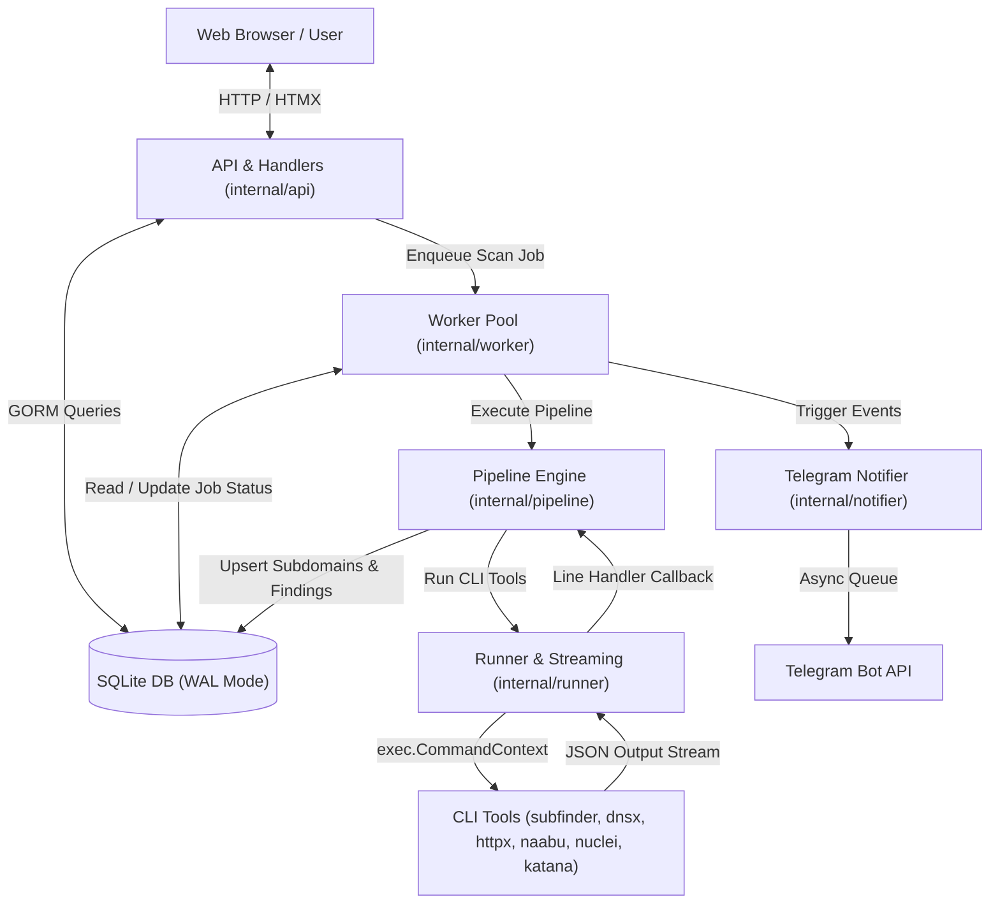

# ARCHITECTURE REVIEW — Django Recon Application

## Current Architecture

## Architecture Evaluation

### Component Breakdown
1. **`cmd/server/main.go`**: Entry point orchestrating dependency injection, HTTP server initialization, worker pool start, and graceful signal-driven shutdown.
2. **`internal/api`**: Web handlers rendering HTML pages via `html/template` and HTMX partials. Performs GORM database queries.
3. **`internal/worker`**: Goroutine worker pool with fixed concurrency (3 workers default) and buffered channel task queue.
4. **`internal/pipeline`**: Strategy registry (`Registry`) loading pipeline definitions from `configs/tools.yaml`. Chains steps and passes target outputs via stdin/args.
5. **`internal/runner`**: Execution engine using `exec.CommandContext` with asynchronous line-by-line `bufio.Scanner` streaming and panic isolation.
6. **`internal/notifier`**: Asynchronous rate-limited message queue processing Telegram notifications.
7. **`internal/db`**: SQLite database connection manager configuring WAL journal mode and GORM models.
